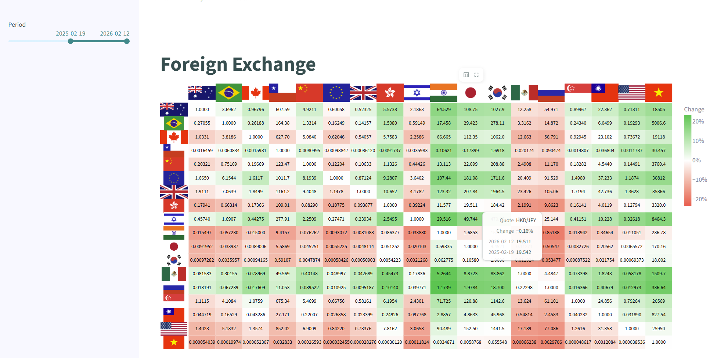
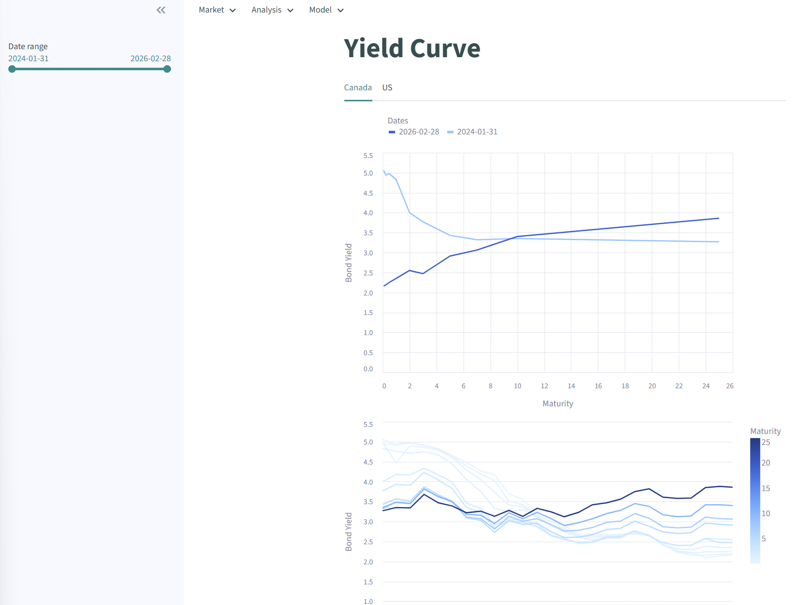
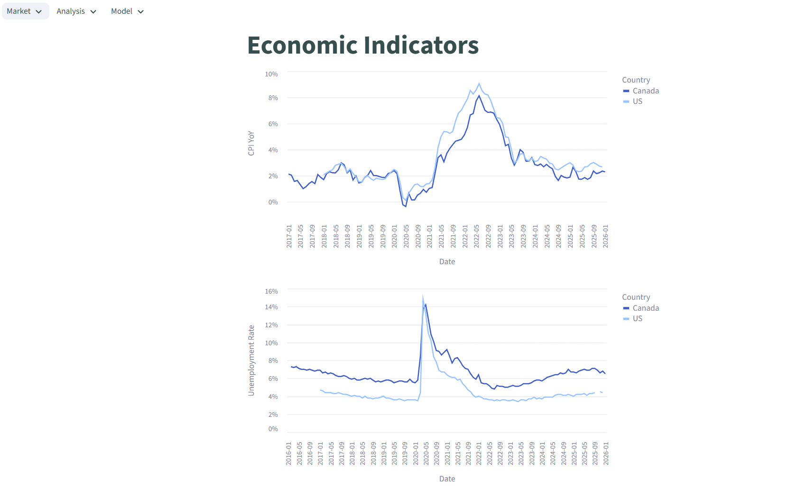
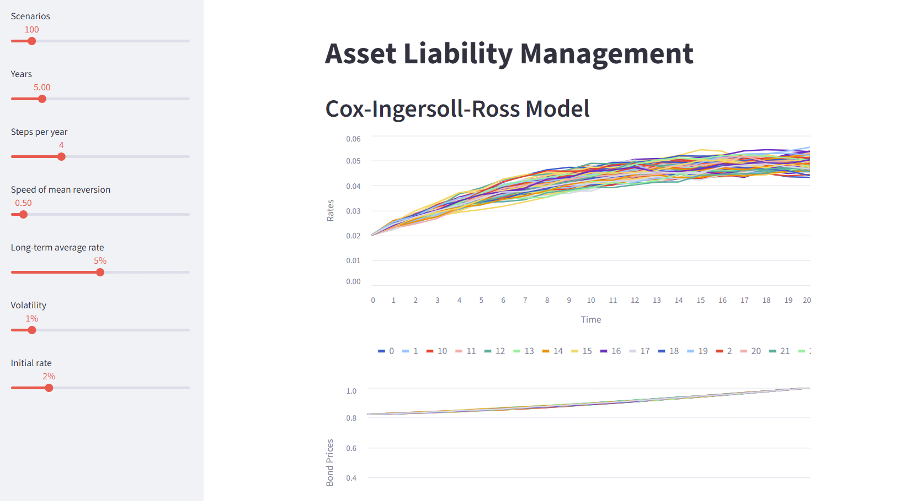
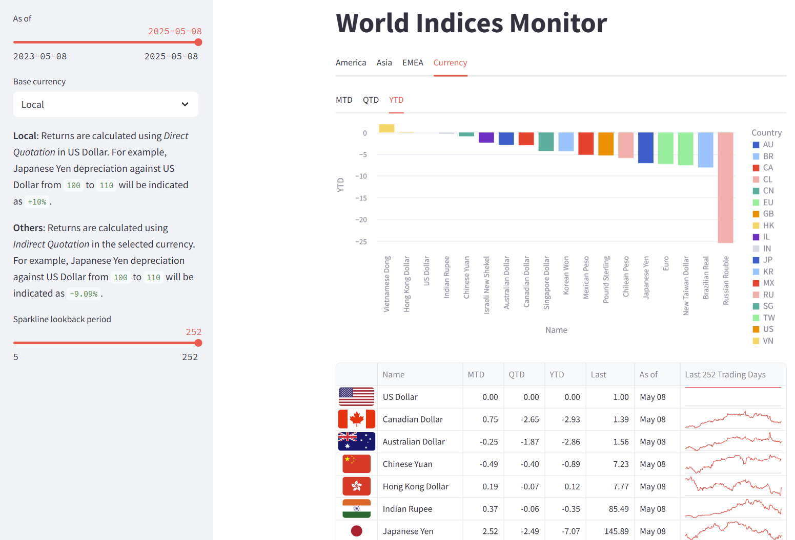
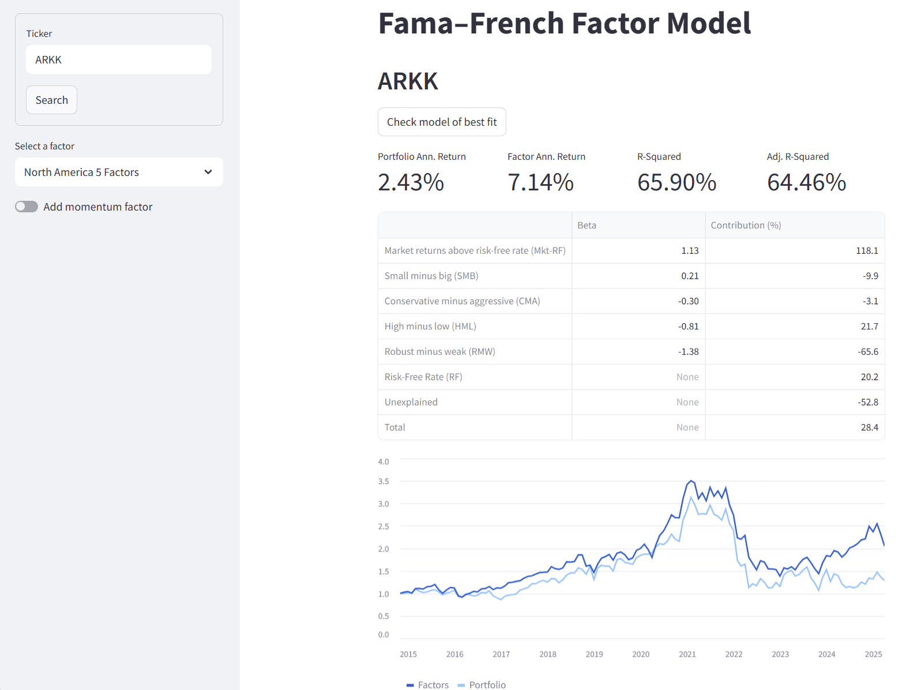
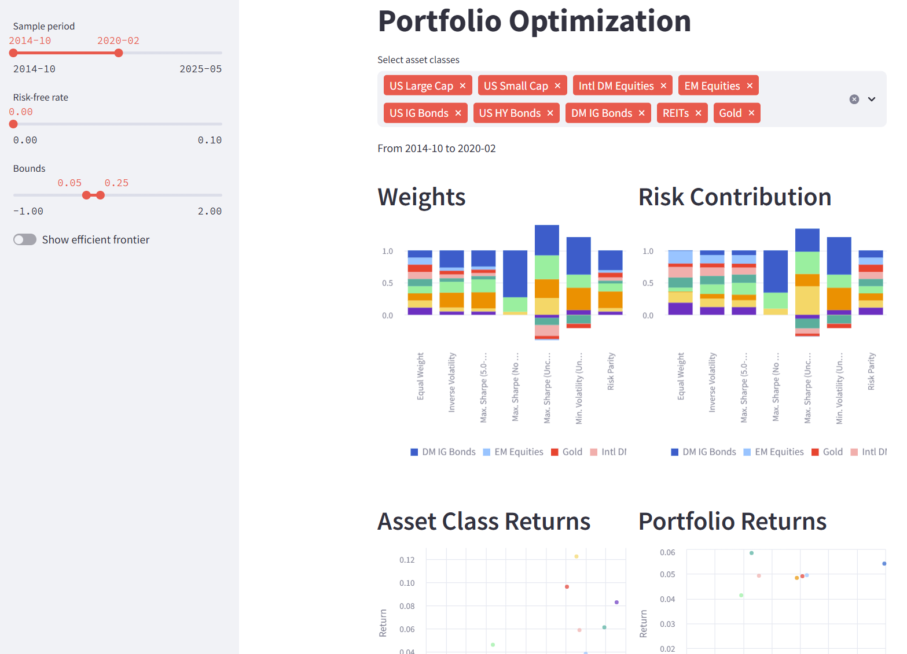
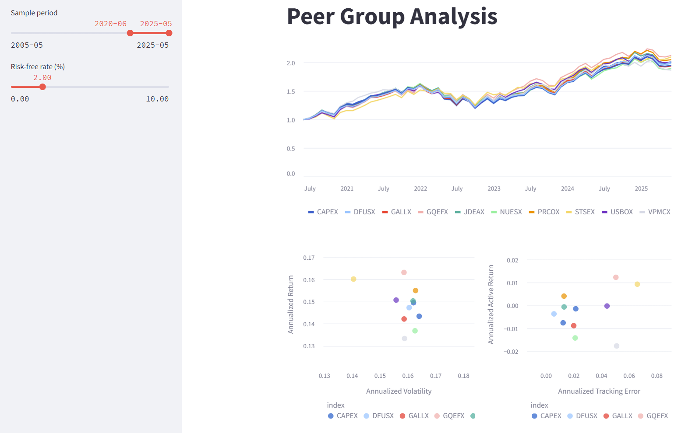
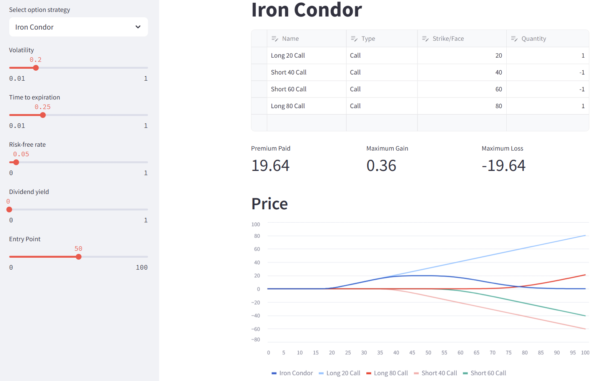

# Streamlit web apps using Financial Toolkit

[Streamlit](https://streamlit.io/) is a powerful framework that transforms Python scripts into interactive web applications.

In this repository, I have created several web apps that demonstrate common use cases in investment management, leveraging the [Financial Toolkit](https://github.com/chris-kc-cheng/financial-toolkit).

Click the badge below to launch the web app — a lightweight alternative to Bloomberg.

## App 10: Foreign Exchange

This web application visualizes cross-currency exchange rates in a heatmap format, displaying real-time quotes and corresponding percentage changes.

## App 9: Periodic Table

This web app displays a periodic-table-style summary of returns across different asset classes and hedge fund strategies. Users can customize the table by selecting different time horizons, adjusting conditional formatting, changing the order, and choosing the reference point.

## App 8: Yield Curve

This web app shows how the Canadian and US yield curves move over time.

## App 7: Economic Indicators

This web app tracks Canadian and US economic indicators (CPI and unemployment rate) over time.

## App 6: Asset Liability Management

The web app uses the Cox–Ingersoll–Ross (CIR) model to generate interest-rate scenarios that evolve over time while reverting toward a long-term level.

## App 5: Market Index Data

This web app retrieves data on major equity indices and currencies from Yahoo! Finance and displays their performance using interactive charts and tables. The currency and time horizon are fully customizable.

## App 4: Fama-French Factor Analysis

This web app retrieves the returns of a user-specified fund and analyzes its factor loadings using the Fama-French model.

## App 3: Portfolio Optimization

This web app compares the risk–reward profiles and risk contributions of various portfolio weighting schemes, such as Risk Parity, Maximum Sharpe Ratio, and Minimum Volatility. The asset mix, constraints, and time horizon are all fully customizable.

## App 2: Peer Group Analysis

This web app compares the performance and risk metrics of a peer group against a benchmark. Users can define their investment universe and benchmark via URL parameters using the following format:

`https://terminal.streamlit.app/peers?fund=FUND1&fund=FUND2&benchmark=BM`

## App 1: Option Strategies

This web app presents the values of individual securities and the total payoffs of various option strategies. Theoretical option values are calculated using the Black-Scholes model. Additional charts illustrate how the Greeks change across different spot prices.

The source code is hosted on GitHub at: https://github.com/chris-kc-cheng/ftk-streamlit.
